# improvement-from-cohort3

## Notes from Unit 1

- Best GitHub Issue from last night (Day 1 or 2)
- Give two GH issue examples when introing: one funny, one really helpful
- Not using flowers to describe Prototypes
  - More Front-end game adjacent (cars?) - describe traits in class one, in class two, group them by what might be a prototype, define those prototypes
  -Side-by-side pictures and code highlights (circle 4 wheels and highlight where it gets it in the code [in the object itself, in the prototype, all the way up])
- Needed clearer callback intro, maybe *start with* setTimeout as a simple example?
- More going over answers
- More links with video tutorials

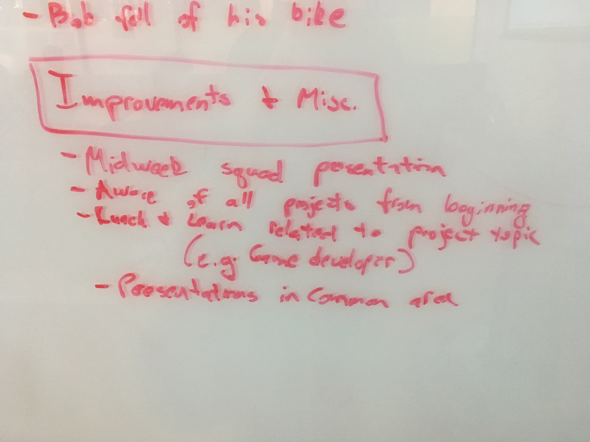
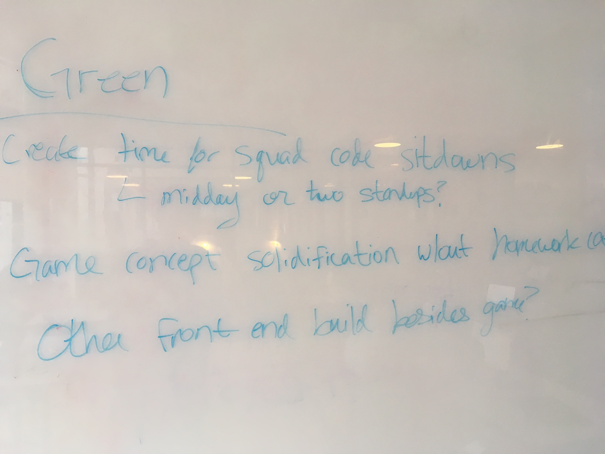
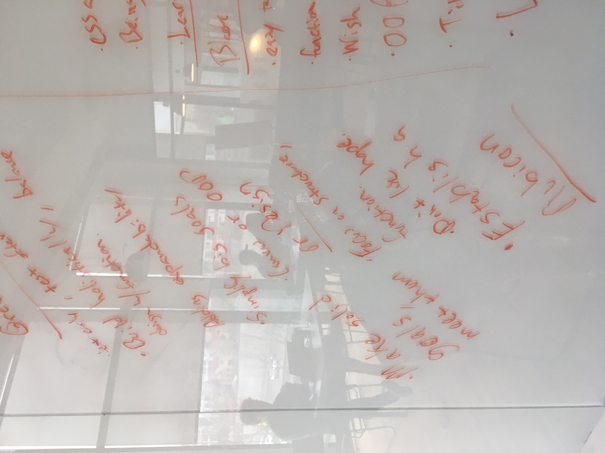
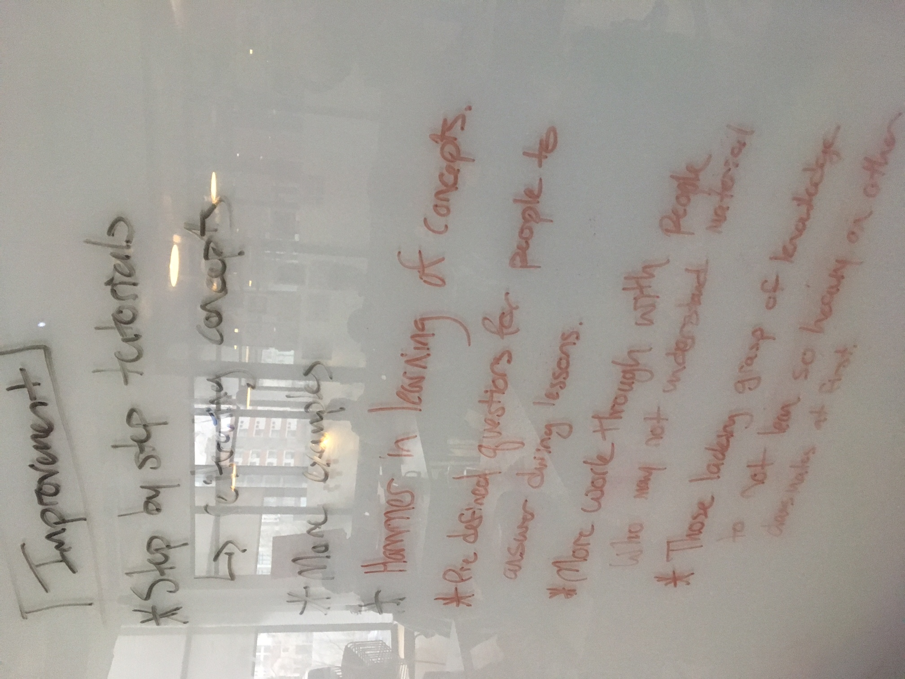

## Notes from Unit 2

- Get Mocha tests in rubric for project 2

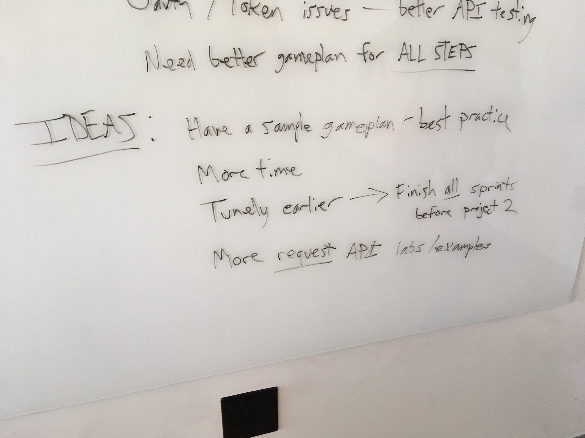
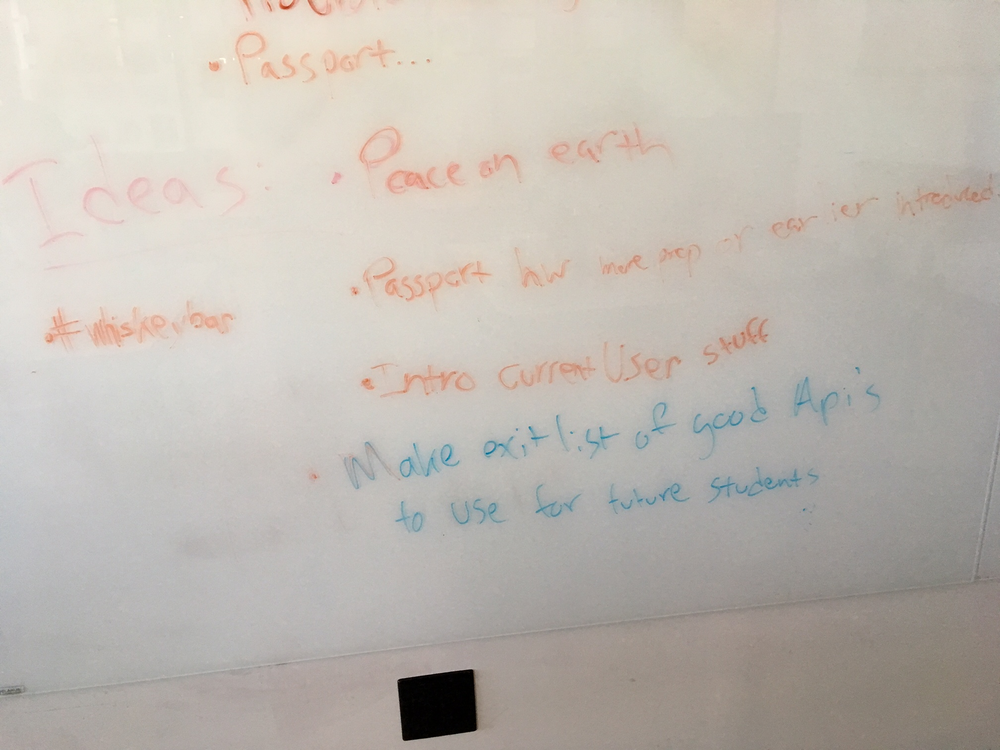
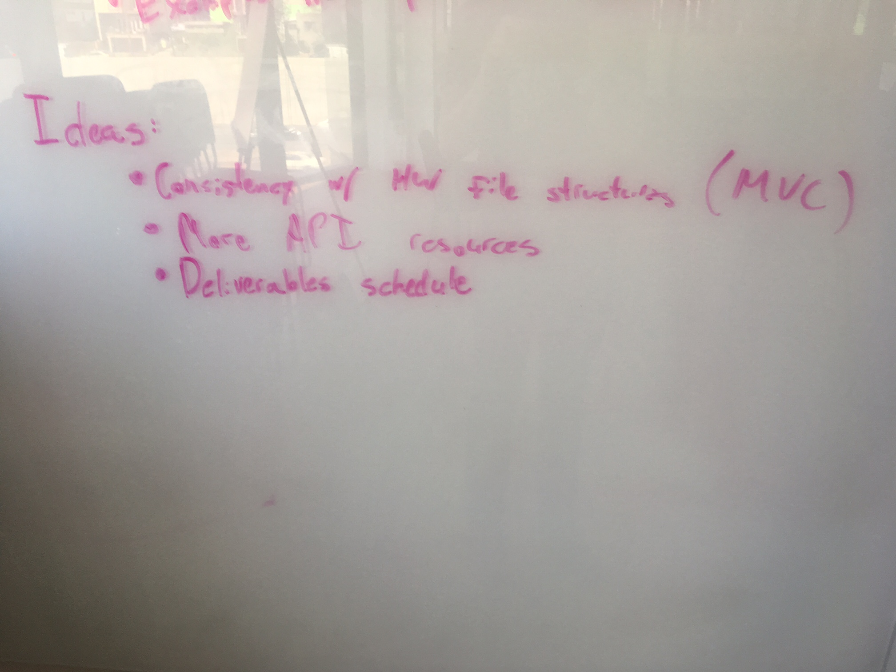
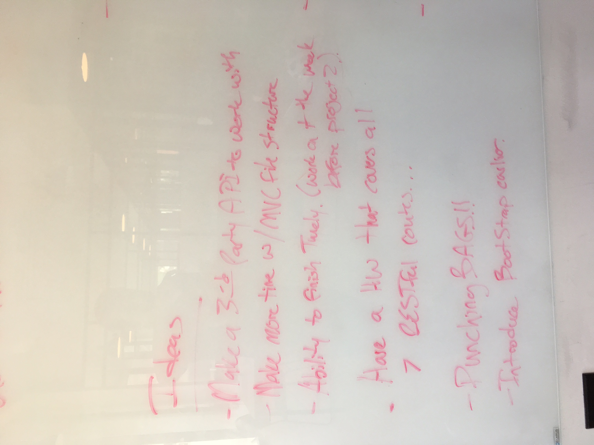

## Notes from Unit 3

- Flip rapid prototype and user testing days 
- Rapid Prototype: clarify 15 minute limit on same error before filing GH issue, make sure they know: You cannot ../ out of your back-end

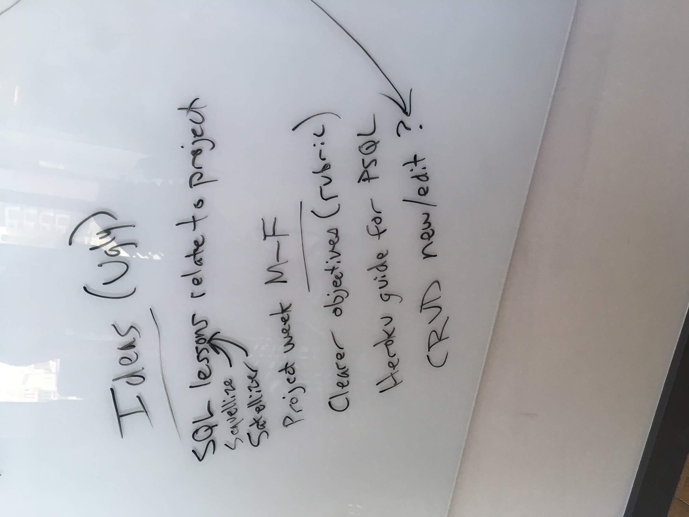
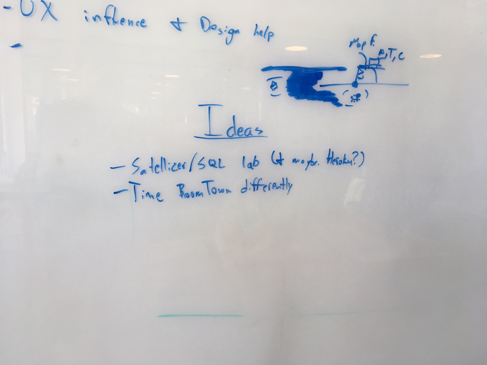
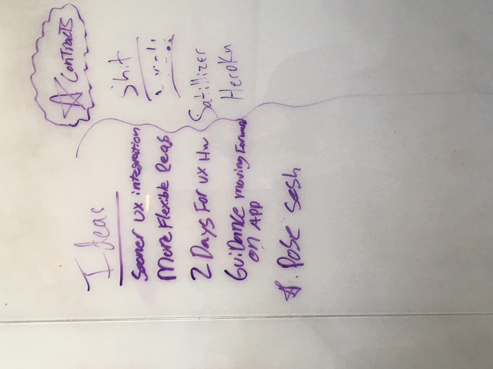
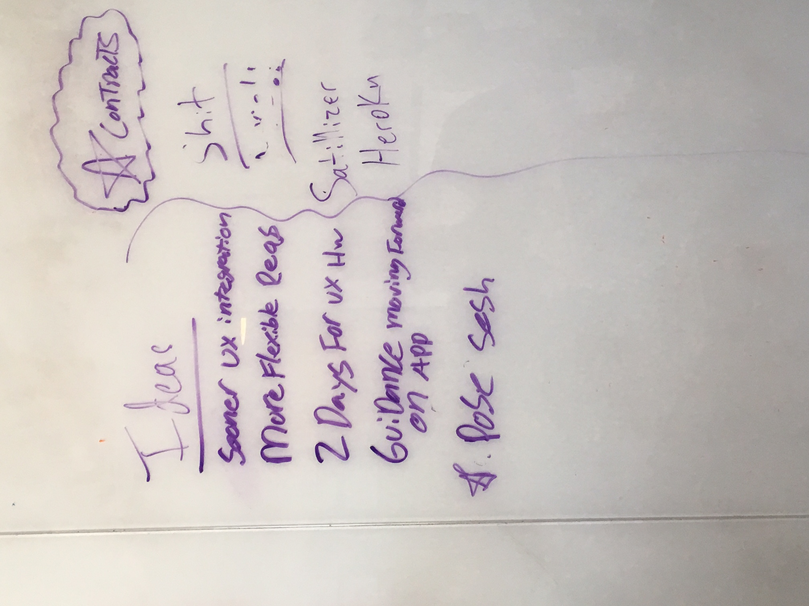
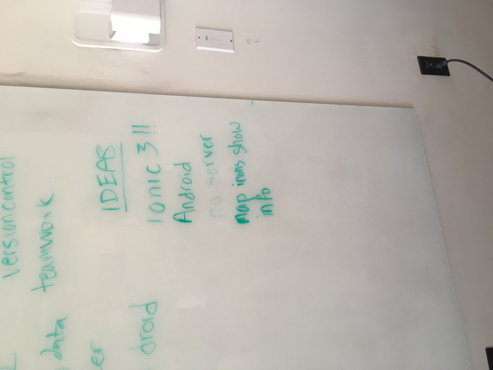

## Nick's Notes

- Can we introduce MVC sooner? [mvc-folder-structure](https://github.com/den-materials/mvc-folder-structure) should be the afternoon after intro to MVC (planes, then planes in folders)
- Almost all lessons could use visuals in some way